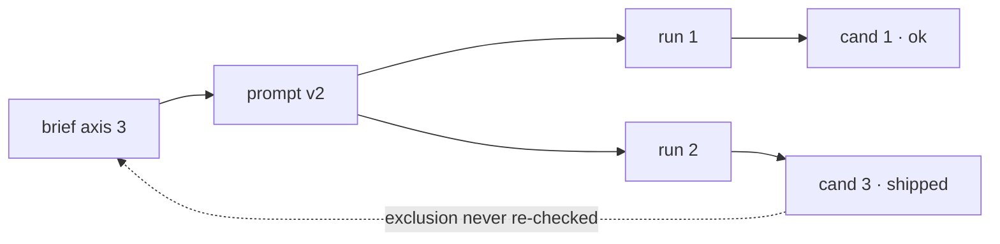

<!-- image:deferred -->
Purpose: the copy-paste form for each trigger, so a diagram costs a minute rather than a decision.
Read when: a finding has hit one of the triggers and the shape is not obvious.
Verified: 2026-08-23 — no automated check reads the drawings. What is checked is
that this page and `visualise` between them define every trigger, form and floor
word the registry declares; a rule in `image-tools/validate.py` re-runs that on
every commit, so a word deleted from here fails the build.

# Forms

Four shapes cover almost everything. Pick by trigger, not by taste.

## `location` — the defect map

The default for this family. Divide the frame the way the picture divides, mark
each finding where it is, number the marks, and let the findings refer to the
numbers.

```
1536 x 1024, viewed at 384px wide

┌───────────────────┬───────────────────┐
│                   │                   │
│                   │      ① sign       │
│                   │                   │
├───────────────────┼───────────────────┤
│  ② left hand      │                   │
│                   │   ③ (100% only)   │
└───────────────────┴───────────────────┘

① blocking  the sign reads "PRODCUT"; the brief quoted "PRODUCT" verbatim
② major     six digits, visible at shipping size
③ minor     repeating grain, not visible below 100%
```

The grid is the picture's own division, not a fixed quarters — thirds for a
composition brief that named thirds, a single band for a header. Say the
dimensions and the size you judged at, or the marks mean nothing.

## `disagreement` — two columns

Both sides, one row per property, the disagreement on its own line. Never two
paragraphs.

```
                   asked for        on disk
size               1536x1024        1254x1254   ← disagree
format             PNG              PNG
alpha              yes              no          ← disagree
```

Also the form for one file at two sizes, or one member against the set's
standard.

## `ordering` — the timeline

Two lanes, time to the right, and a mark where the trouble is. Only when the
order is the finding — if the same steps in any order fail, it is `hops`.

```
generate ──▶ pick ──▶ export ──▶ strip
                        │           │
                        │           └─ removes the profile
                        └─ converted assuming the profile is there
                           ▲ the export read a profile the strip then dropped
```

## `hops` — the chain

Left to right, one arrow per step, each node naming something that exists. Hang
the finding off the step it is at.

```
brief axis 3 ──▶ prompt "Avoid:" ──▶ run 2 ──▶ candidate 3
                      │
                      └─ the exclusion was dropped when the prompt was
                         reworded; nothing downstream re-checked it
```

## Mermaid, when it is a graph

More than about six nodes, or branching and merging that ASCII would misalign.
It needs a renderer, so it is a trade.

````

````

Keep node labels to what was opened. A mermaid graph is as easy to fill with
untraced edges as a sentence is, and harder to argue with, which is the danger.

## Drawing them

- Box characters `┌ ┐ └ ┘ ├ ┤ ┬ ┴ ┼ │ ─`, arrows `──▶ ▲ ▼ └─`
- Keep the whole thing under about 70 columns so nothing wraps in a terminal
- Circled numbers `① ② ③` for marks; they survive being pasted anywhere
- Align by spaces, never tabs
- A legend under the drawing, not inside it

## What none of these do

They do not carry evidence. A map shows where a finding is, not that anyone
looked — the grade beside the finding says that, and a beautifully drawn
`asserted` is still `asserted`.
